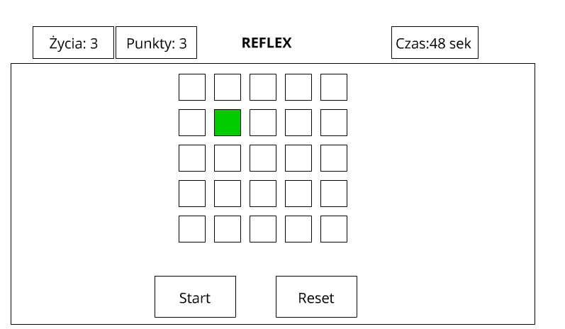

# Zadanie rekrutacyjne - JavaScript

Zadanie rekrutacyjne dla osób aplikujących na stanowisko Młodszy Programista JavaScript.

### Zadanie polega na stworzeniu  w JS gry „Reflex”

##### Uwagi ogólne
- nie należy korzystać z żadnych zewnętrznych bibliotek (wyjątkiem, lecz nie wymogiem, jest Bootstrap)
- nie należy korzystać z żadnych frameworków
- mile widziane użycie TypeScript
- odpowiedzi prosimy przesyłać w formie linku do repozytorium

##### Wytyczne
1)    Gra rozpoczyna się od wciśnięcia przycisku ”Start”
2)    Rozgrywka trwa 60 sekund lub do straty ostatniego życia (gracz ma trzy „życia”)
3)    Czas widoczny w prawym górnym rogu
4)    Na środku gry wyświetlone są kwadraty (liczba podawana z parametru)
5)    Co 3 sekundy losowo wybrany kwadrat zapala się na zielono
6)    Kwadrat jest zapalony na zielono 2 sekundy i w tym czasie gracz musi go kliknąć
7)    Jeśli graczowi uda się kliknąć zielony, kwadrat dostaje 1 punkt
8)    Gracz traci życie, jeśli w trafi w inny kwadrat lub jeśli podświetlenie zielonego kwadratu zniknie po  2 sekundach. Pojawia się alert „straciłeś życie”
9)    Grę można zresetować - wyzerowany zostaje licznik czasu i punktów, a licznik „życia” wraca do stanu początkowego (np. 3)

##### Rysunek poglądowy

### Forma wykonania zadania

Opcjonalnie możesz skorzystać z przygotowanego przez nas projektu webpackowego, który znajduje się w bieżącym repozytorium (nie jest to jednak warunek konieczny). Poniżej znajdziesz instrukcję korzystania z tego projektu.

##### Utworzenie repozytorium

1. Stwórz nowy projekt na swoim GitHubie, nie dodając do niego żadnych plików.

2. Skopiuj [zawartość niniejszego repozytorium](https://gitlab.gwo.pl/recruitment/zadanie-rekrutacyjne---javascript/-/archive/master/zadanie-rekrutacyjne---javascript-master.zip) i rozpakuj pliki.

3. W katalogu z rozpakowanymi plikami zainicjalizuj nowy projekt git: `git init`.

4. Dodaj adres zdalnego repozytorium, utworzonego w punkcie pierwszym: `git remote add origin https://github.com/<nazwa-użytkownika>/<nazwa-repozytorium>.git`.

##### Instalacja

Instalacja projektu sprowadza się do zainstalowania niezbędnych zależności za pomocą polecenia `yarn install` lub `npm install`.

##### Praca nad projektem

Za pomocą komendy `yarn start` lub `npm start` uruchom serwer developerski, który będzie dostępny pod adresem [http://localhost:9000](http://localhost:9000).

Plikiem wejściowym będzie plik `src/index.ts`, jednak jeśli preferujesz zwykły JavaScript, wystarczy zmienić nazwę pliku wejściowego na `src/index.js`. Również wszystkie importowane moduły możesz tworzyć w wersji TypeScript lub JavaScript (a nawet korzystać zarówno z jednych, jak i drugich).

Pliki statyczne serwowane są z folderu `dist`, do którego z kolei automatycznie trafia zawartość folderu `src/static`. Oznacza to, że np. plik `src/static/style.css` będzie dostępny pod adresem [http://localhost:9000/style.css](http://localhost:9000/style.css).

Możesz swobodnie modyfikować ustawienia projektu. Prosimy tylko, aby po skopiowaniu repozytorium oraz zainstalowaniu zależności projekt nadal można było uruchamiać poleceniem `yarn start` lub `npm start`.
